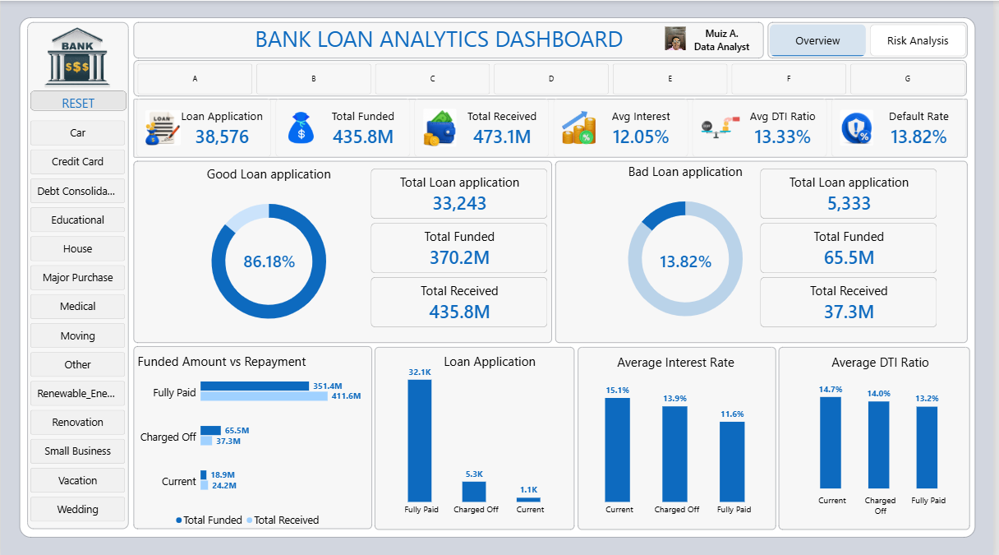
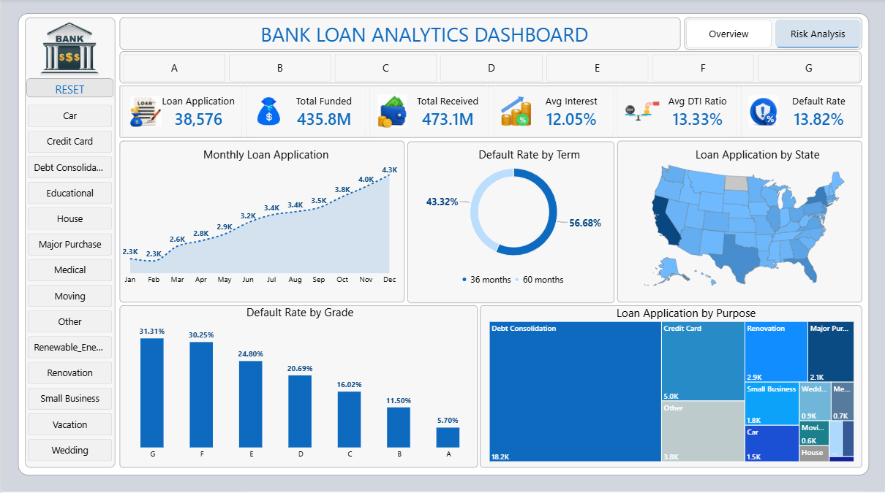

# Bank-Loan-Analytics-Dashboard
An end-to-end loan portfolio analytics project using Excel and Power BI to analyze loan applications, funding, repayment, borrower risk, and default patterns across 38K+ loans.

## Business Problem
A lending institution needs visibility into the health of its loan book: how much has been funded, how much has been recovered, loan status and where default risk is concentrated across grade, term, and geography.
This dashboard answers questions for stakeholders who wants to monitor, need a fast and accurate read on portfolio performance without digging through raw records.

## Tools & Technologies
| Tool                | Purpose                                           |
| ------------------- | ------------------------------------------------- |
| **Microsoft Excel** | Data cleaning, validation and preparation         |
| **Power BI**        | Data modeling, analysis and dashboard development |
| **DAX**             | KPI calculations and portfolio metrics            |

## Dataset
The dataset contains 38,576 loan records and includes fields covering:
- **Loan information:** Loan ID, issue date, loan amount, purpose, term, and loan status
- **Borrower information:** Annual income, employment length, employment title, home ownership, and state
- **Credit risk:** Grade, sub-grade, verification status, interest rate, and debt-to-income (DTI) ratio
- **Payment information:** Installment, total amount received, last payment date, and next payment date
- **Account information:** Member ID and total accounts

## Data Preparation & Approach
The dataset was first reviewed and prepared in **Microsoft Excel**.The column names and field definitions to understand the structure of the dataset, Date fields were verified, missing or blank values as well as duplicate records across relevant fields were checked. It was cleaned and KPI formulas (SUM, AVERAGE,SUMIF,COUNTIF) alongside PivotTables, Power Query were used to transform and validate the dataset for reporting
After validation, the cleaned dataset was imported into **Power BI** for modeling and analysis.

## Data Model

The flat source file was normalized using the simple **star-schema approach**, with the loan dataset serving as the central fact table and supporting dimension tables to support clean filtering and scalable analysis.

### Model Structure

- **Fact Table – Financial Loan:** Contains the individual loan-level records and the core measures used for portfolio analysis, including loan amount, total amount received, interest rate, DTI ratio, and loan status.
- **Grade Dimension:** Contains the unique loan grade and sub-grade combinations used to analyze portfolio risk.
- **Date Dimension:** A dedicated calendar table was created to support time-based analysis of loan applications, including year and month-level reporting.

## Key Performance Indicators

The dashboard uses a set of core KPIs to provide a high-level view of loan portfolio size, funding, repayment, pricing, borrower leverage, and credit risk.

### Portfolio KPIs

- **Total Loan Applications:** Measures the number of unique loan applications in the portfolio.
- **Total Funded Amount:** Measures the total value of loans issued to borrowers.
- **Total Amount Received:** Measures the cumulative amount received from borrowers against the loans.
- **Average Interest Rate:** Shows the average interest rate across the loan portfolio.
- **Average DTI Ratio:** Shows the average debt-to-income ratio of borrowers, providing an indication of overall borrower leverage.
- **Default Rate:** Measures the proportion of loan applications classified as charged off relative to total loan applications.

## Dashboard

The Power BI dashboard was designed to provide both a high-level overview of the loan portfolio and a deeper analysis of portfolio risk and performance.

### Page 1 – Overview

The Overview page provides a summary of the overall loan portfolio through key performance indicators and interactive visuals.

It includes:

- Total loan applications
- Total funded amount
- Total amount received
- Average interest rate
- Average DTI ratio
- Default rate
- Good versus bad loan distribution
- Funded amount versus amount received by loan status
- Loan applications by loan status
- Average interest rate by loan status
- Average DTI ratio by loan status

Users can interact with the dashboard using filters such as **Risk Grade** and **Loan Purpose** to examine different segments of the portfolio.

### Page 2 – Risk Analysis

The Risk Analysis page focuses on identifying patterns in loan performance and borrower risk.

It includes analysis of:

- Loan application trends over time
- Loan applications by state
- Loan applications by loan purpose
- Default rate by loan term
- Default rate across risk grades
- Funding and portfolio performance across risk grades

The interactive design allows users to move from overall portfolio performance into specific risk segments and identify areas requiring closer attention.

## Key Insights

The following insights are based on the full loan portfolio.The dashboard's interactive filters allow users to explore how portfolio metrics change across individual segments.

### 1. Overall Portfolio Performance

The portfolio contains 38,576 loan applications, with 435.8M in total funding and 473.1M in total amount received. While the overall received-to-funded ratio is 108.6%,this overall total hides the huge losses from bad loans.

### 2. Charged-Off Loans Represent a Significant Capital Loss

Loans that ultimately charged off received approximately 37.3M against 65.5M funded, leaving approximately 28.2M unrecovered. This highlights the importance of monitoring default exposure alongside overall portfolio recovery(we must track bad debt risks alongside overall money recovered).

### 3. Default Risk Rises Sharply Across Risk Grades

Default rates increase consistently from 5.7% for Grade A loans to 31.3% for Grade G loans. The huge difference demonstrates a strong relationship between risk grade and observed loan performance.

### 4. Longer Loan Terms Carry Higher Default Risk

Loans with a 60-month term have a 22.3% default rate compared with 10.7% for 36-month loans. This means loans with longer terms carry substantially higher default risk, making loan term an important risk factor in the portfolio.

### 5. Loan Pricing Increases with Risk

Average interest rates rise steadily from 7.4% for Grade A loans to 21.4% for Grade G loans. Higher-risk segments are therefore associated with substantially higher borrowing costs.

### 6. Debt Consolidation Drives Portfolio Volume

Debt Consolidation accounts for 18,214 applications, representing 47.2% of the entire portfolio. Its default rate of approximately 14.6% is slightly above the overall portfolio default rate of 13.8%. It isn't an especially risky loan category on its own. However, because it represents such a large share of total lending, it accounts for nearly half (49.7%) of every loan that has ever charged off in the entire book. In other words, Debt Consolidation isn't a high-risk category - it's a high-volume category, and its size alone makes it the biggest single driver of total losses. Any strategy to lower overall portfolio losses will have a great impact by targeting this segment, simply because of how much of the book it represents.

### 7. Loan Applications Are Geographically Concentrated

California alone accounts for 6,894 applications ( approximately 18% of the entire book), more than double the next state (New York, 3,701). This indicates significant geographic concentration in California, creating potential exposure to regional concentration risk.

## Business Recommendations
### 1. Strengthen underwriting and monitoring for higher-risk grades

The analysis shows a clear increase in default rates as risk grade moves from A to G. Higher-risk grades should therefore receive closer attention during both loan approval and portfolio monitoring.
The bank could consider applying stricter underwriting criteria, stronger affordability checks, or additional monitoring to higher-risk segments. This could help reduce default exposure while still allowing the business to serve borrowers across different risk levels.

### 2. Review the risk and return of 60-month loans

Loans with a 60-month term have a 22.3% default rate, compared with 10.7% for 36-month loans. This significant difference suggests that longer loan terms deserve closer review.
The bank could evaluate whether the additional interest earned from longer-term loans adequately compensates for their higher default risk. Where appropriate, shorter terms or additional eligibility requirements could be considered for borrowers with higher-risk profiles.

### 3. Prioritize monitoring of Debt Consolidation loans

Debt Consolidation represents 47.2% of all loan applications and accounts for approximately 49.7% of charged-off loans. Its default rate is only slightly above the overall portfolio rate, so the issue is not that Debt Consolidation is inherently high-risk.
Rather, its large share of the portfolio means that problems within this segment can have a significant impact on overall portfolio losses. The business should therefore closely monitor this segment and look for ways to improve performance without unnecessarily restricting lending to this large customer group.

### 4. Monitor geographic concentration

California accounts for approximately 18% of all loan applications, considerably more than any other state in the portfolio. While high application volume does not necessarily mean higher credit risk, such concentration creates greater exposure to one geographic market.
The bank should monitor portfolio growth and loan performance by state to ensure that geographic concentration does not become an increasing source of portfolio exposure.

### 5. Continue using risk-based pricing, but regularly evaluate its effectiveness

Interest rates increase steadily across the risk grades, with Grade A averaging 7.4% and Grade G averaging 21.4%. This indicates that higher-risk borrowers are being charged higher rates to reflect their greater observed risk.
The bank should continue using risk-based pricing, but regularly assess whether the additional interest earned from higher-risk segments is sufficient to compensate for their higher default rates and associated losses. This can help maintain a balance between growth, borrower affordability, and portfolio profitability.
